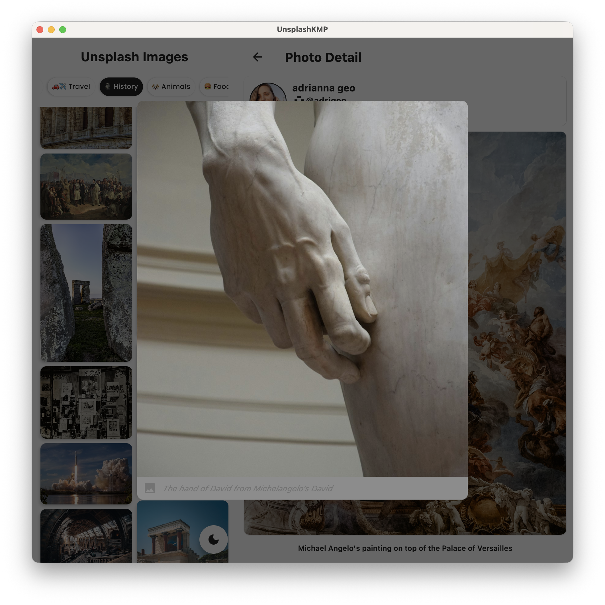

## Unsplash-API-KMP 

A project to display images from [Unsplash](https://unsplash.com) API using Kotlin Multiplatform

## Features

* Jetpack Compose
* Coil KMP
* MVI Architecture
* Kotlin Coroutines with Flow
* Koin
* Kotlin Gradle DSL
* Cashapp Paging
* Ktorfit
* Compose Navigation v3

## Libraries

- [Jetpack Compose](https://developer.android.com/jetpack/compose) - Android’s modern toolkit for
  building native UI.
- [Coil KMP](https://github.com/coil-kt/coil) - An image loading library for Android & KMP
  backed by Kotlin Coroutines.
- [View Model](https://developer.android.com/topic/libraries/architecture/viewmodel) - Presenter for
  persisting view state across config changes
- [Ktorfit](https://foso.github.io/Ktorfit/installation/) - type safe http client and supports coroutines out
  of the box.
- [Kotlin Serialization](https://kotlinlang.org/docs/serialization.html#serialize-and-deserialize-json) - JSON
  Parser,used to parse requests from the API
- [kotlinx.coroutines](https://github.com/Kotlin/kotlinx.coroutines) - Library Support for
  coroutines
- [Cashapp Paging](https://github.com/cashapp/multiplatform-paging) - The Paging Library
  makes it easier for you to load data gradually and gracefully within your app based off Google's Paging3 Library
- [Compose Navigation v3](https://developer.android.com/guide/navigation/navigation-3) - Navigation 3 is a new navigation library designed to work with Compose
- [Koin](https://insert-koin.io/docs/reference/koin-mp/kmp/) - Kotlin Multiplatform Dependency Injection

## Prerequisite

* To successfully make API calls to [Unsplash](https://unsplash.com) Endpoint, use a valid API Token from Unsplash.
* Enter your valid API token [here](./composeApp/src/commonMain/kotlin/di/Koin.kt#L63)

## Mobile App Screenshots

|  |  |
|-----------------------------------------------------------|-----------------------------------------------------------|

|  |  |
|------------------------------------------------------------|-------------------------------------------------------------|

## Desktop App Screenshots

|  |  |
|------------------------------------------------------------|------------------------------------------------------------|

## Before running

- Check your system with [KDoctor](https://github.com/Kotlin/kdoctor)
- Install JDK 17 or higher on your machine

#### Android

To run the application on android device/emulator:

- open project in Android Studio and run imported android run configuration

#### Desktop

Run the desktop application: `./gradlew :composeApp:run` or `./gradlew run` or `./gradlew hotRunDesktop` for hot reload

#### iOS

To run the application on iPhone device/simulator:

- Open `iosApp/iosApp.xcproject` in Xcode and run standard configuration
- Or use [Kotlin Multiplatform Mobile plugin](https://plugins.jetbrains.com/plugin/14936-kotlin-multiplatform-mobile)
  for Android Studio
  Run iOS simulator UI tests: `./gradlew :composeApp:iosSimulatorArm64Test`

 
